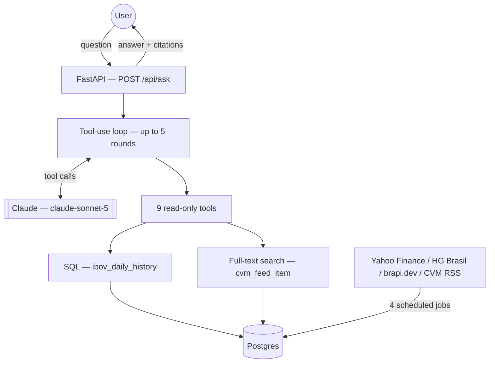

# RAG Finance IBOV

*[Leia em português](README.pt-BR.md)*

A Portuguese-language chat system that answers questions about the
**Ibovespa** index (Brazil's main stock market benchmark) and **CVM**
(Brazilian securities regulator) announcements — grounded entirely in
real, queryable data, with measured faithfulness, an executable security
review, and a full CI pipeline. Built as a case study in applied AI
engineering: RAG architecture decisions, LLM evaluation, tool-calling
security, and what actually happens when a model swap silently breaks
production quality.


-brightgreen)


## Problem

Someone following the Brazilian market wants answers like *"how did the
Ibovespa perform in 2023?"* or *"has the CVM board decided anything
recently?"* — today that means manually cross-referencing index history,
current quotes, and a regulatory feed. A generic LLM without retrieval
will happily hallucinate a plausible-sounding number instead of admitting
it doesn't know.

## Solution

Claude, given 9 read-only tools, decides what data it needs and pulls it
from a Postgres database kept fresh by four independent ingestion
pipelines — never computing a number itself, never citing a value without
its source and date, and explicitly refusing to answer four categories of
question it has no data for (individual stock quotes, investment advice,
future predictions, anything outside the ~2016-present index history).

**Framing correction, stated up front rather than left for a reader to
discover:** despite the name, this is **not** a vector-embedding RAG
system. There is no chunking, no embedding model, no vector store. Retrieval
is two deterministic mechanisms — parameterized SQL for the numeric index
series, PostgreSQL full-text search for the CVM feed — a decision made and
re-validated against real evaluation data, not an unfinished feature. See
[ADR-002](docs/adr/ADR-002-rag-architecture.md) for the full reasoning.

## Architecture



Full detail: [`docs/architecture/`](docs/architecture/) (overview,
data-flow, RAG pipeline, AI architecture, deployment) and
[`docs/system-design/`](docs/system-design/) (context, scalability,
reliability, security, trade-offs).

## RAG Pipeline

| Stage | How it works | Why |
|---|---|---|
| Ingestion | 4 independent jobs (Yahoo Finance backfill, HG Brasil daily, brapi.dev, CVM RSS), each with retry/backoff, idempotent upserts, and an append-only audit trail | Real bugs were found and fixed here — a non-reproducible backfill window, unbounded tool inputs — see Engineering Challenges below |
| Chunking / Embeddings | **Not present, by design** | Corpus is a numeric time series and ~60 short regulatory items — not the shape vector retrieval is built for; see [ADR-002](docs/adr/ADR-002-rag-architecture.md) |
| Retrieval | Exact SQL point/range queries (numeric) + `tsvector` full-text search (CVM) | Correctness over approximation, for a domain where "close enough" is a worse failure mode than "insufficient data" |
| Context assembly | Tool results injected directly as `tool_result` blocks — no dedup/ranking pass needed at this data volume | Verified: mean ~5,100 input tokens/request, nowhere near a real context-budget constraint |
| Generation | System-prompt-enforced grounding: never compute a number, always cite source + date, refuse 4 explicit out-of-scope categories | Structural, not just instructional — see AI Architecture below |

Full review: [`docs/architecture/rag-pipeline.md`](docs/architecture/rag-pipeline.md).

## AI Architecture

- **Generator**: `claude-sonnet-5` (configurable via `ANTHROPIC_MODEL`).
- **Judge** (evaluation only, never generation): `claude-opus-4-8` —
  deliberately a different model than the generator, to avoid identity
  bias. Both live-verified against the real API.
- **Grounding is structural**: all arithmetic happens in SQL, not in the
  model — there is no code path for the LLM to fabricate a number without
  a tool call producing it first.
- **No forced JSON schema on the final answer** (reads naturally in a chat
  UI); structured output *is* enforced on every tool call (JSON Schema)
  and every evaluation judge call (forced tool-use + Pydantic validation).

Full detail: [`docs/architecture/ai-architecture.md`](docs/architecture/ai-architecture.md),
[ADR-001](docs/adr/ADR-001-llm-selection.md).

## Tool Calling

9 tools, **all read-only**, dispatched through a closed allowlist (not a
dynamic lookup) — verified with an executable test that unknown/adversarial
tool names never execute anything
(`tests/security/test_tool_allowlist.py`). Two real vulnerabilities were
found and fixed while building the security test suite:

1. **Unbounded `limit`** on the CVM search tools — a manipulated model call
   could have requested unbounded result sets. Fixed with a server-side
   clamp independent of the (LLM-facing, not fully trusted) schema.
2. **Unhandled malformed input** — a NUL byte in tool input crashed the
   request with a raw exception instead of the intended graceful
   `{"error": ...}` contract. Fixed with proper exception handling and a
   defensive transaction rollback.

Full per-tool audit: [`docs/ai/tool-calling.md`](docs/ai/tool-calling.md).

## Evaluation

Custom LLM-as-judge (not `ragas` — its available version had a broken
import chain, documented rather than silently worked around) decomposing
answers into atomic claims and checking each against the actual tool-call
context used. 15-case golden dataset covering factual, temporal,
aggregation, multi-hop, and 4 adversarial categories.

**Real, persisted, artifact-backed results** (not narrative claims —
[`docs/evaluation/results/`](docs/evaluation/results/) has the raw JSON):

| Metric | Threshold | Run 1 | Run 2 |
|---|---|---|---|
| Faithfulness | ≥ 0.85 | **0.909** ✓ | **0.935** ✓ |
| Answer relevancy | ≥ 0.80 | **0.973** ✓ | **0.977** ✓ |
| Error rate | 0% | **0%** ✓ | **0%** ✓ |

A retrieval-metrics limitation is stated rather than hidden: Precision@K /
Recall@K / MRR aren't computed, because the two retrieval-dependent golden
cases have no reliable ground-truth relevant-set against a live-updating
feed — see [`docs/evaluation/methodology.md`](docs/evaluation/methodology.md)
for why, and what it would take to build one.

## Model Regression — a real incident, not a hypothetical

Swapping the generator to a smaller model (`claude-haiku-4-5`) for
cost/latency dropped faithfulness from 0.899 to **0.767** — below the
0.85 gate. Root cause: the smaller model sometimes skipped the required
tool call and answered from parametric memory instead, breaking the
system's core grounding guarantee. Reverted; the reconfirmed post-revert
baseline (0.909-0.935) is now backed by persisted evaluation artifacts, not
just prose.

A regression check (`scripts/check_regression.py`) now exists and is
**proven, with a unit test using the actual historical numbers, to catch
this exact incident automatically**:
[`tests/unit/test_eval_regression.py::test_check_run_against_baseline_catches_the_actual_haiku_regression`](tests/unit/test_eval_regression.py).

Full case study: [`docs/evaluation/model-regression-case-study.md`](docs/evaluation/model-regression-case-study.md).

## Security

Threat-by-threat AI security review
([`docs/security/AI_SECURITY.md`](docs/security/AI_SECURITY.md)) covering
prompt injection, indirect injection, data poisoning, excessive agency,
tool abuse, denial of wallet, secret exposure, and data leakage — scoped to
this system's actual attack surface (read-only tools, public data, no
auth-by-design), not a generic checklist. Application security review in
[`docs/security/APP_SECURITY.md`](docs/security/APP_SECURITY.md).

Both real vulnerabilities mentioned above were found by writing
**executable** adversarial tests (`tests/security/`), not by review alone —
SQL-injection-style payloads, oversized inputs, and malformed bytes fed
through the real tool dispatch against a real Postgres instance.
`pip-audit` runs in CI on every push; zero known dependency vulnerabilities
as of the last run.

## Observability

Structured logging (per-request summary — tokens, latency, tool calls,
model, never query/answer content), a global exception handler that never
leaks internal detail to the client, and every evaluation run persisted as
a queryable JSON artifact. No live metrics dashboard or distributed
tracing — a deliberate scope decision for a single-user system, stated
explicitly rather than implied to exist:
[`docs/observability.md`](docs/observability.md),
[ADR-006](docs/adr/ADR-006-observability.md).

## Testing

**166 tests** across 4 tiers:

| Tier | Count | What it needs |
|---|---|---|
| Unit | 112 | Nothing — mocked DB/LLM, runs in ~7s |
| Integration + E2E + Security | 39 | A real Postgres (Docker) |
| AI Evaluation (`llm_eval`) | 15 | Real Postgres + a real, billed Anthropic API key |

`tests/e2e/` exercises the complete real stack (FastAPI → tool-use loop →
real Postgres → response) with only the outbound LLM call mocked, to avoid
per-test-run API cost. `tests/security/` and `tests/integration/` run
against a real-data seed fixture ([`db/seed/`](db/seed/)) so they pass
against a genuinely fresh database, not just the original dev machine.

## CI/CD

`.github/workflows/ci.yml` — lint, type check (mypy, non-blocking against
a measured 18-error baseline, not silently skipped), unit tests,
integration tests (real Postgres service container + seed fixture),
security tests + `pip-audit`, Docker build — on every push/PR.

`.github/workflows/eval.yml` — the real, billed evaluation + regression
gate, deliberately **not** run per-commit (manual trigger + weekly
schedule instead — each run costs real money, ~US$0.74 measured).
Documented trade-off, not a silent omission.

## Deployment

Containerized (`Dockerfile` + `docker-compose.yml`, verified end-to-end:
build → up → both services healthy → app reaches Postgres over the Docker
network with real data visible). Currently runs **locally only** — no
public deployment, by deliberate choice: this project already hit one
free-tier resource-limit wall (the original Supabase→local-Postgres
migration), and a single-user tool with no auth story doesn't need to
repeat that risk to have portfolio value. Recommended path if it ever needs
one: [`docs/deployment/strategy.md`](docs/deployment/strategy.md),
[ADR-008](docs/adr/ADR-008-deployment.md).

## Performance

Real, measured (not estimated) from 30 real generation requests:

- **Mean latency**: ~7.3s/request — dominated by LLM API round-trip time,
  not local compute (SQL queries are fast, indexed, small tables).
- **No optimization was made** — the data doesn't show a bottleneck worth
  fixing yet. Full analysis: [`docs/cost-performance.md`](docs/cost-performance.md).

## Cost

**~US$0.013/request**, derived from real token counts
(`response.usage`), not guessed. Full evaluation runs (15 cases, generator
+ judge) cost ~US$0.74, also measured, not estimated.

## Engineering Challenges

Real problems found and fixed while building this, in the order they
surfaced:

1. **Non-reproducible backfill window** — a relative `range=10y` API
   parameter produced different date windows depending on when the job
   ran; fixed with explicit `period1`/`period2` dates.
2. **The model regression** (above) — the centerpiece engineering story of
   this project.
3. **Evaluation results were never persisted** — only narrative prose
   existed for the original faithfulness numbers. Fixed by extending the
   eval script to write timestamped JSON artifacts, then independently
   re-measuring the post-revert baseline for the first time.
4. **Unbounded tool input + unhandled malformed input** — two real
   security bugs found by writing executable adversarial tests, not by
   review alone (see Security above).
5. **CI would have silently failed** — the existing integration test suite
   asserted real historical data values and was never designed to run
   against a fresh, empty database, which is exactly what CI starts from.
   Found while validating the CI design (not left for CI's first real run
   to discover); fixed with a real-data seed fixture.
6. **Migrations weren't safely re-runnable** — fixed with a tracking table,
   verified against both the real dev database (bootstrapped without data
   loss) and a fresh throwaway container.
7. **Ran out of API credit mid-project** — a real, reported constraint
   (not hidden): further real-LLM-call calibration and adversarial testing
   is blocked pending more credit. Documented in
   [`docs/audit/IMPLEMENTATION_PROGRESS.md`](docs/audit/IMPLEMENTATION_PROGRESS.md)
   rather than silently worked around.

## Architecture Decisions

8 ADRs in [`docs/adr/`](docs/adr/): LLM selection, RAG architecture,
retrieval strategy, evaluation strategy, tool calling, observability,
security, deployment — each with Context/Decision/Alternatives/
Trade-offs/Consequences.

## Demo

No public demo — this is a personal-use tool by deliberate design (see
Deployment/Security above). Run it locally in a few minutes (below) to see
the real thing.

## Screenshots

*(Run locally to see the chat interface — a public demo isn't part of this
project's scope, see Deployment above.)*

## Local Development

```bash
# 1. Install dependencies
uv sync --extra dev

# 2. Start Postgres (and, optionally, the containerized app)
docker compose up -d              # Postgres only
# docker compose up -d --build    # Postgres + the app, fully containerized

# 3. Configure environment variables
cp .env.example .env
# fill in ANTHROPIC_API_KEY and HG_BRASIL_API_KEY;
# DATABASE_URL is already set for the local Postgres from step 2

# 4. Apply migrations (idempotent — safe to re-run)
uv run python scripts/apply_migrations.py

# 5a. Populate with real data (calls real external APIs)
uv run python scripts/run_ibov_backfill.py
uv run python scripts/run_cvm_poller.py
uv run python scripts/run_hg_brasil_ingestion.py
uv run python scripts/run_brapi_ingestion.py
# 5b. ...or load the same real-data snapshot CI uses (faster, no external calls)
psql "$DATABASE_URL" -f db/seed/dev_seed.sql

# 6. Start the chat UI
uv run python scripts/run_chat_web.py
# open http://127.0.0.1:8000

# 7. Run the tests
uv run pytest -q                          # unit only, no DB/network needed
uv run pytest -q -m integration           # + integration/e2e/security (needs Postgres)
uv run ruff check src tests scripts       # lint
uv run mypy src                           # type check (18 known pre-existing errors)
uv run python scripts/run_eval.py         # full evaluation — costs real API tokens
uv run python scripts/check_regression.py # regression gate against the calibrated baseline
```

## Environment Variables

All documented with comments in [`.env.example`](.env.example) — including
`HOST`/`PORT` (which control whether the unauthenticated app is reachable
beyond localhost — read this before changing them).

## Project Structure

```
src/rag_b3/
├── ingestion/        4 independent pipelines (Yahoo Finance, HG Brasil, brapi.dev, CVM RSS)
├── query/            Deterministic SQL over the Ibovespa index
├── retrieval/        Full-text search over CVM regulatory items
├── generation/        System prompt, tool definitions/dispatch, the tool-use loop
├── eval/               Custom LLM-as-judge + regression-check logic
├── web/                 FastAPI app
├── dashboard/            Ingestion-health HTML report generator
└── common/                DB connection, audit logging, pricing, logging config

tests/
├── unit/          112 tests, no DB/network
├── integration/    Real Postgres
├── e2e/              Full stack, LLM call mocked
├── security/           Executable adversarial tests
└── evaluation/           README pointing to where eval tests actually live

docs/
├── audit/           Full technical audit + session-by-session progress log
├── architecture/      Component/data-flow/RAG-pipeline/AI-architecture docs
├── ai/                  Tool-calling audit
├── security/              AI + application security reviews
├── evaluation/               Methodology, baseline, regression, model-regression case study
├── system-design/              Context, scalability, reliability, security, trade-offs
├── adr/                          8 architecture decision records
├── deployment/                     Deployment strategy
└── portfolio/                       Portfolio summary, technical highlights, interview guide
```

## Roadmap

Real, open gaps — not hidden:

- Rate limiting on `/api/ask` (currently none — acceptable only because
  the tool surface is read-only and the app isn't publicly reachable).
- The 18-error mypy baseline (measured, not fixed — see
  [`docs/audit/TECHNICAL_AUDIT.md`](docs/audit/TECHNICAL_AUDIT.md) F-18).
- The regression baseline needs recalibration with ≥5 runs once more API
  budget is available (currently n=2).
- `ci.yml`/`eval.yml` have only been locally simulated, not yet verified
  against a real GitHub Actions run.
- Retrieval-quality metrics (Precision@K/Recall@K/MRR) remain unmeasured —
  reasoned limitation, see Evaluation above.

---

Personal portfolio project. All rights reserved.
