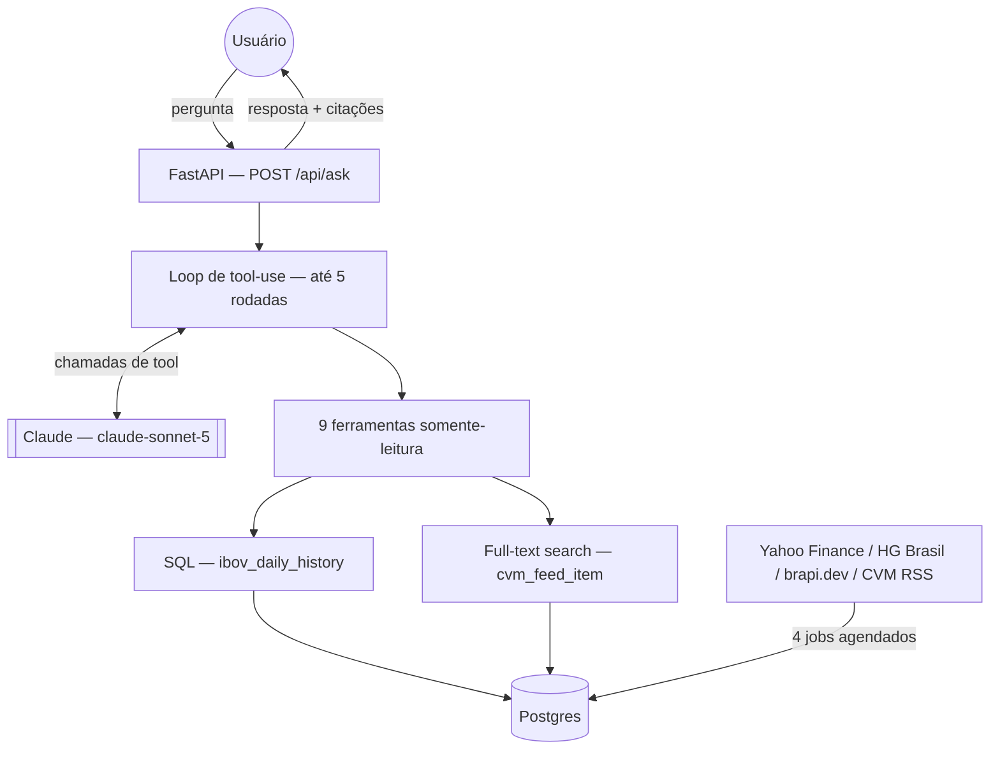

# RAG Finance IBOV

*[Read in English](README.md)*

Um sistema de chat em português que responde perguntas sobre o índice
**Ibovespa** e sobre comunicados da **CVM** (Comissão de Valores
Mobiliários) — com respostas fundamentadas em dado real e consultável,
faithfulness medida, revisão de segurança executável e um pipeline de CI
completo. Construído como um estudo de caso de engenharia de IA aplicada:
decisões de arquitetura RAG, avaliação de LLM, segurança de tool-calling e
o que acontece de verdade quando uma troca de modelo quebra a qualidade em
produção silenciosamente.


-brightgreen)


## O problema

Quem acompanha o mercado brasileiro quer respostas como *"qual foi a
variação do Ibovespa em 2023?"* ou *"o colegiado da CVM decidiu algo
recentemente?"* — hoje isso exige cruzar manualmente série histórica,
cotação atual e calendário regulatório. Um LLM genérico sem retrieval
alucina um número plausível em vez de admitir que não sabe.

## A solução

O Claude, com acesso a 9 ferramentas somente-leitura, decide qual dado
precisa e busca no Postgres, mantido atualizado por quatro pipelines de
ingestão independentes — nunca calculando um número "de cabeça", nunca
citando um valor sem fonte e data, e recusando explicitamente quatro
categorias de pergunta para as quais não tem dado (cotação de ação
individual, recomendação de investimento, previsão futura, qualquer coisa
fora do histórico do índice desde ~2016).

**Correção de enquadramento, dita de saída em vez de deixar o leitor
descobrir sozinho:** apesar do nome, isto **não é** um sistema de RAG
vetorial. Não há chunking, não há modelo de embedding, não há vector store.
O retrieval é feito por dois mecanismos determinísticos — SQL parametrizado
para a série numérica do índice, full-text search do Postgres para o feed
da CVM — uma decisão tomada e revalidada contra dado real de avaliação, não
uma funcionalidade inacabada. Ver [ADR-002](docs/adr/ADR-002-rag-architecture.md)
para o raciocínio completo.

## Arquitetura



Detalhe completo: [`docs/architecture/`](docs/architecture/) (overview,
data-flow, pipeline RAG, arquitetura de IA, deployment) e
[`docs/system-design/`](docs/system-design/) (contexto, escalabilidade,
confiabilidade, segurança, trade-offs).

## Pipeline RAG

| Etapa | Como funciona | Por quê |
|---|---|---|
| Ingestão | 4 jobs independentes (backfill Yahoo Finance, HG Brasil diário, brapi.dev, CVM RSS), cada um com retry/backoff, upsert idempotente e trilha de auditoria append-only | Bugs reais foram achados e corrigidos aqui — janela de backfill não-reprodutível, limite de tool sem bound — ver Desafios de Engenharia abaixo |
| Chunking / Embeddings | **Ausentes, por decisão de projeto** | O corpus é uma série numérica + ~60 itens regulatórios curtos — não é o formato para o qual retrieval vetorial foi feito; ver [ADR-002](docs/adr/ADR-002-rag-architecture.md) |
| Retrieval | Queries SQL exatas por ponto/intervalo (numérico) + full-text search `tsvector` (CVM) | Correção sobre aproximação, para um domínio onde "quase certo" é um modo de falha pior que "dado insuficiente" |
| Context assembly | Resultados de tool injetados direto como blocos `tool_result` — sem passo de dedup/ranking, desnecessário neste volume de dado | Verificado: média de ~5.100 tokens de entrada/requisição, longe de ser uma restrição real de orçamento de contexto |
| Geração | Grounding imposto pelo system prompt: nunca calcular um número, sempre citar fonte + data, recusar 4 categorias explícitas fora de escopo | Estrutural, não só instrucional — ver Arquitetura de IA abaixo |

Revisão completa: [`docs/architecture/rag-pipeline.md`](docs/architecture/rag-pipeline.md).

## Arquitetura de IA

- **Gerador**: `claude-sonnet-5` (configurável via `ANTHROPIC_MODEL`).
- **Juiz** (só avaliação, nunca geração): `claude-opus-4-8` —
  deliberadamente um modelo diferente do gerador, para evitar identity
  bias. Ambos verificados ao vivo contra a API real.
- **Grounding é estrutural**: toda aritmética acontece em SQL, não no
  modelo — não existe caminho de código para o LLM fabricar um número sem
  uma chamada de tool produzi-lo primeiro.
- **Sem schema JSON forçado na resposta final** (lê naturalmente numa
  interface de chat); output estruturado *é* imposto em toda chamada de
  tool (JSON Schema) e em toda chamada do juiz de avaliação (tool-use
  forçado + validação Pydantic).

Detalhe completo: [`docs/architecture/ai-architecture.md`](docs/architecture/ai-architecture.md),
[ADR-001](docs/adr/ADR-001-llm-selection.md).

## Tool Calling

9 ferramentas, **todas somente-leitura**, despachadas por uma allowlist
fechada (não um lookup dinâmico) — verificado com um teste executável que
prova que nomes de tool desconhecidos/adversariais nunca executam nada
(`tests/security/test_tool_allowlist.py`). Duas vulnerabilidades reais
foram achadas e corrigidas ao escrever a suíte de testes de segurança:

1. **`limit` sem limite superior** nas tools de busca CVM — uma chamada de
   modelo manipulada poderia pedir um result set sem limite. Corrigido com
   um clamp no servidor, independente do schema (que é orientado ao LLM,
   não totalmente confiável).
2. **Input malformado não tratado** — um byte NUL no input de uma tool
   derrubava a requisição com uma exceção crua em vez do contrato
   `{"error": ...}` esperado. Corrigido com tratamento de exceção adequado
   e rollback defensivo de transação.

Auditoria completa por tool: [`docs/ai/tool-calling.md`](docs/ai/tool-calling.md).

## Avaliação

LLM-as-judge próprio (não `ragas` — a versão disponível tinha uma cadeia de
import quebrada, documentado em vez de contornado silenciosamente),
decompondo respostas em alegações atômicas e checando cada uma contra o
contexto real usado nas chamadas de tool. Golden dataset de 15 casos
cobrindo categorias factual, temporal, agregação, multi-hop e 4
adversariais.

**Resultados reais, persistidos, com artefato** (não afirmações narrativas
— [`docs/evaluation/results/`](docs/evaluation/results/) tem o JSON bruto):

| Métrica | Threshold | Run 1 | Run 2 |
|---|---|---|---|
| Faithfulness | ≥ 0.85 | **0.909** ✓ | **0.935** ✓ |
| Answer relevancy | ≥ 0.80 | **0.973** ✓ | **0.977** ✓ |
| Taxa de erro | 0% | **0%** ✓ | **0%** ✓ |

Uma limitação de métricas de retrieval é declarada, não escondida:
Precision@K / Recall@K / MRR não são calculados porque os dois casos do
golden dataset que dependem de retrieval não têm um relevant-set de
verdade confiável contra um feed que muda ao vivo — ver
[`docs/evaluation/methodology.md`](docs/evaluation/methodology.md) para o
porquê e o que seria necessário para construir um.

## Regressão de Modelo — um incidente real, não hipotético

Trocar o gerador para um modelo menor (`claude-haiku-4-5`) por
custo/latência derrubou a faithfulness de 0.899 para **0.767** — abaixo do
gate de 0.85. Causa raiz: o modelo menor às vezes pulava a chamada de tool
obrigatória e respondia de memória paramétrica, quebrando a garantia
central de grounding do sistema. Revertido; o baseline pós-revert
reconfirmado (0.909-0.935) agora tem artefatos de avaliação persistidos,
não só prosa.

Um regression check (`scripts/check_regression.py`) agora existe e é
**provado, com um teste unitário usando os números históricos reais, a
pegar esse incidente exato automaticamente**:
[`tests/unit/test_eval_regression.py::test_check_run_against_baseline_catches_the_actual_haiku_regression`](tests/unit/test_eval_regression.py).

Case study completo: [`docs/evaluation/model-regression-case-study.md`](docs/evaluation/model-regression-case-study.md).

## Segurança

Revisão de segurança de IA ameaça-por-ameaça
([`docs/security/AI_SECURITY.md`](docs/security/AI_SECURITY.md)) cobrindo
prompt injection, indirect injection, data poisoning, excessive agency,
tool abuse, denial of wallet, secret exposure e data leakage — escopada
para a superfície de ataque real deste sistema (tools somente-leitura,
dado público, sem autenticação por decisão de projeto), não um checklist
genérico. Revisão de segurança de aplicação em
[`docs/security/APP_SECURITY.md`](docs/security/APP_SECURITY.md).

As duas vulnerabilidades reais acima foram achadas escrevendo testes
adversariais **executáveis** (`tests/security/`), não só por revisão —
payloads estilo SQL injection, inputs gigantes e bytes malformados
passados pelo dispatch real de tools contra um Postgres real. `pip-audit`
roda em CI em todo push; zero vulnerabilidades de dependência conhecidas na
última execução.

## Observabilidade

Logging estruturado (resumo por requisição — tokens, latência, chamadas de
tool, modelo, nunca o conteúdo de pergunta/resposta), um handler global de
exceção que nunca vaza detalhe interno ao cliente, e toda execução de
avaliação persistida como artefato JSON consultável. Sem dashboard de
métricas ao vivo ou tracing distribuído — uma decisão de escopo deliberada
para um sistema de usuário único, declarada explicitamente em vez de
implicada como existente:
[`docs/observability.md`](docs/observability.md),
[ADR-006](docs/adr/ADR-006-observability.md).

## Testes

**166 testes** em 4 camadas:

| Camada | Quantidade | O que precisa |
|---|---|---|
| Unit | 112 | Nada — DB/LLM mockados, roda em ~7s |
| Integration + E2E + Security | 39 | Postgres real (Docker) |
| AI Evaluation (`llm_eval`) | 15 | Postgres real + chave real da API Anthropic (com custo) |

`tests/e2e/` exercita a pilha real completa (FastAPI → loop de tool-use →
Postgres real → resposta) com só a chamada de LLM mockada, para evitar
custo de API a cada execução de teste. `tests/security/` e
`tests/integration/` rodam contra uma fixture de seed com dado real
([`db/seed/`](db/seed/)), então passam contra um banco genuinamente novo,
não só a máquina de dev original.

## CI/CD

`.github/workflows/ci.yml` — lint, type check (mypy, não-bloqueante contra
uma baseline medida de 18 erros, não escondida), testes unitários, testes
de integração (container real de serviço Postgres + fixture de seed),
testes de segurança + `pip-audit`, build Docker — em todo push/PR.

`.github/workflows/eval.yml` — a avaliação real, com custo, + gate de
regressão, deliberadamente **não** rodada a cada commit (trigger manual +
agendamento semanal em vez disso — cada execução custa dinheiro real,
~US$0,74 medido). Trade-off documentado, não uma omissão silenciosa.

## Deployment

Containerizado (`Dockerfile` + `docker-compose.yml`, verificado ponta a
ponta: build → up → ambos os serviços saudáveis → app alcança o Postgres
pela rede Docker com dado real visível). Roda **só localmente** hoje — sem
deployment público, por escolha deliberada: este projeto já bateu numa
parede de limite de plano gratuito uma vez (a migração original
Supabase→Postgres local), e uma ferramenta de usuário único sem história
de autenticação não precisa repetir esse risco para ter valor de
portfólio. Caminho recomendado se algum dia precisar:
[`docs/deployment/strategy.md`](docs/deployment/strategy.md),
[ADR-008](docs/adr/ADR-008-deployment.md).

## Performance

Real, medido (não estimado) a partir de 30 requisições de geração reais:

- **Latência média**: ~7,3s/requisição — dominada pelo round-trip da API
  do LLM, não por computação local (queries SQL são rápidas, indexadas,
  tabelas pequenas).
- **Nenhuma otimização foi feita** — o dado não mostra um gargalo que valha
  a pena corrigir ainda. Análise completa: [`docs/cost-performance.md`](docs/cost-performance.md).

## Custo

**~US$0,013/requisição**, derivado de contagem real de tokens
(`response.usage`), não estimado. Rodadas completas de avaliação (15
casos, gerador + juiz) custam ~US$0,74, também medido, não estimado.

## Desafios de Engenharia

Problemas reais achados e corrigidos ao construir isto, na ordem em que
surgiram:

1. **Janela de backfill não-reprodutível** — um parâmetro relativo
   `range=10y` da API produzia janelas de data diferentes dependendo de
   quando o job rodava; corrigido com datas `period1`/`period2` explícitas.
2. **A regressão de modelo** (acima) — a história central de engenharia
   deste projeto.
3. **Resultados de avaliação nunca eram persistidos** — só existia prosa
   narrativa para os números originais de faithfulness. Corrigido
   estendendo o script de eval para escrever artefatos JSON com timestamp,
   depois remedindo independentemente o baseline pós-revert pela primeira
   vez.
4. **Tool input sem limite + input malformado não tratado** — duas
   vulnerabilidades reais achadas escrevendo testes adversariais
   executáveis, não só por revisão (ver Segurança acima).
5. **O CI teria falhado silenciosamente** — a suíte de testes de
   integração existente afirmava valores reais de dado histórico e nunca
   foi projetada para rodar contra um banco novo e vazio, que é exatamente
   de onde o CI começa. Achado ao validar o desenho do CI (não deixado para
   a primeira execução real do CI descobrir); corrigido com uma fixture de
   seed com dado real.
6. **Migrações não eram seguras para re-rodar** — corrigido com uma tabela
   de tracking, verificado tanto contra o banco de dev real (bootstrapado
   sem perda de dado) quanto contra um container descartável novo.
7. **Ficou sem crédito de API no meio do projeto** — uma restrição real,
   reportada (não escondida): mais calibração e testes adversariais com
   LLM real ficam bloqueados até mais crédito. Documentado em
   [`docs/audit/IMPLEMENTATION_PROGRESS.md`](docs/audit/IMPLEMENTATION_PROGRESS.md)
   em vez de contornado silenciosamente.

## Decisões de Arquitetura

8 ADRs em [`docs/adr/`](docs/adr/): seleção de LLM, arquitetura RAG,
estratégia de retrieval, estratégia de avaliação, tool calling,
observabilidade, segurança, deployment — cada um com Contexto/Decisão/
Alternativas/Trade-offs/Consequências.

## Demo

Sem demo pública — esta é uma ferramenta de uso pessoal por decisão
deliberada (ver Deployment/Segurança acima). Rode localmente em poucos
minutos (abaixo) para ver de verdade.

## Screenshots

*(Rode localmente para ver a interface de chat — uma demo pública não faz
parte do escopo deste projeto, ver Deployment acima.)*

## Desenvolvimento Local

```bash
# 1. Instalar dependências
uv sync --extra dev

# 2. Subir o Postgres (e, opcionalmente, o app containerizado)
docker compose up -d              # só Postgres
# docker compose up -d --build    # Postgres + app, totalmente containerizado

# 3. Configurar variáveis de ambiente
cp .env.example .env
# preencha ANTHROPIC_API_KEY e HG_BRASIL_API_KEY;
# DATABASE_URL já vem pronto para o Postgres local do passo 2

# 4. Aplicar as migrações (idempotente — seguro re-rodar)
uv run python scripts/apply_migrations.py

# 5a. Popular com dado real (chama APIs externas reais)
uv run python scripts/run_ibov_backfill.py
uv run python scripts/run_cvm_poller.py
uv run python scripts/run_hg_brasil_ingestion.py
uv run python scripts/run_brapi_ingestion.py
# 5b. ...ou carregue o mesmo snapshot de dado real que o CI usa (mais rápido, sem chamadas externas)
psql "$DATABASE_URL" -f db/seed/dev_seed.sql

# 6. Subir a interface de chat
uv run python scripts/run_chat_web.py
# abre em http://127.0.0.1:8000

# 7. Rodar os testes
uv run pytest -q                          # só unit, sem DB/rede
uv run pytest -q -m integration           # + integration/e2e/security (precisa de Postgres)
uv run ruff check src tests scripts       # lint
uv run mypy src                           # type check (18 erros pré-existentes conhecidos)
uv run python scripts/run_eval.py         # avaliação completa — custa tokens de API reais
uv run python scripts/check_regression.py # gate de regressão contra o baseline calibrado
```

## Variáveis de Ambiente

Todas documentadas com comentários em [`.env.example`](.env.example) —
incluindo `HOST`/`PORT` (que controlam se o app sem autenticação fica
alcançável além de localhost — leia antes de mudar).

## Estrutura do Projeto

```
src/rag_b3/
├── ingestion/        4 pipelines independentes (Yahoo Finance, HG Brasil, brapi.dev, CVM RSS)
├── query/            SQL determinístico sobre o índice Ibovespa
├── retrieval/        Full-text search sobre itens regulatórios da CVM
├── generation/        System prompt, definições/dispatch de tools, loop de tool-use
├── eval/               LLM-as-judge próprio + lógica de regression check
├── web/                 App FastAPI
├── dashboard/            Gerador de relatório HTML de saúde da ingestão
└── common/                Conexão de DB, audit log, pricing, config de logging

tests/
├── unit/          112 testes, sem DB/rede
├── integration/    Postgres real
├── e2e/              Pilha completa, chamada de LLM mockada
├── security/           Testes adversariais executáveis
└── evaluation/           README apontando pra onde os testes de eval realmente vivem

docs/
├── audit/           Auditoria técnica completa + log de progresso sessão a sessão
├── architecture/      Docs de componentes/data-flow/pipeline RAG/arquitetura de IA
├── ai/                  Auditoria de tool-calling
├── security/              Revisões de segurança de IA + aplicação
├── evaluation/               Metodologia, baseline, regressão, case study da regressão de modelo
├── system-design/              Contexto, escalabilidade, confiabilidade, segurança, trade-offs
├── adr/                          8 architecture decision records
├── deployment/                     Estratégia de deployment
└── portfolio/                       Resumo de portfólio, destaques técnicos, guia de entrevista
```

## Roadmap

Lacunas reais, abertas — não escondidas:

- Rate limiting em `/api/ask` (hoje nenhum — aceitável só porque a
  superfície de tools é somente-leitura e o app não é publicamente
  alcançável).
- A baseline de 18 erros de mypy (medida, não corrigida — ver
  [`docs/audit/TECHNICAL_AUDIT.md`](docs/audit/TECHNICAL_AUDIT.md) F-18).
- O baseline de regressão precisa de recalibração com ≥5 execuções quando
  houver mais orçamento de API (hoje n=2).
- `ci.yml`/`eval.yml` só foram simulados localmente, ainda não verificados
  contra uma execução real do GitHub Actions.
- Métricas de qualidade de retrieval (Precision@K/Recall@K/MRR) continuam
  não medidas — limitação justificada, ver Avaliação acima.

---

Projeto pessoal de portfólio. Todos os direitos reservados.
