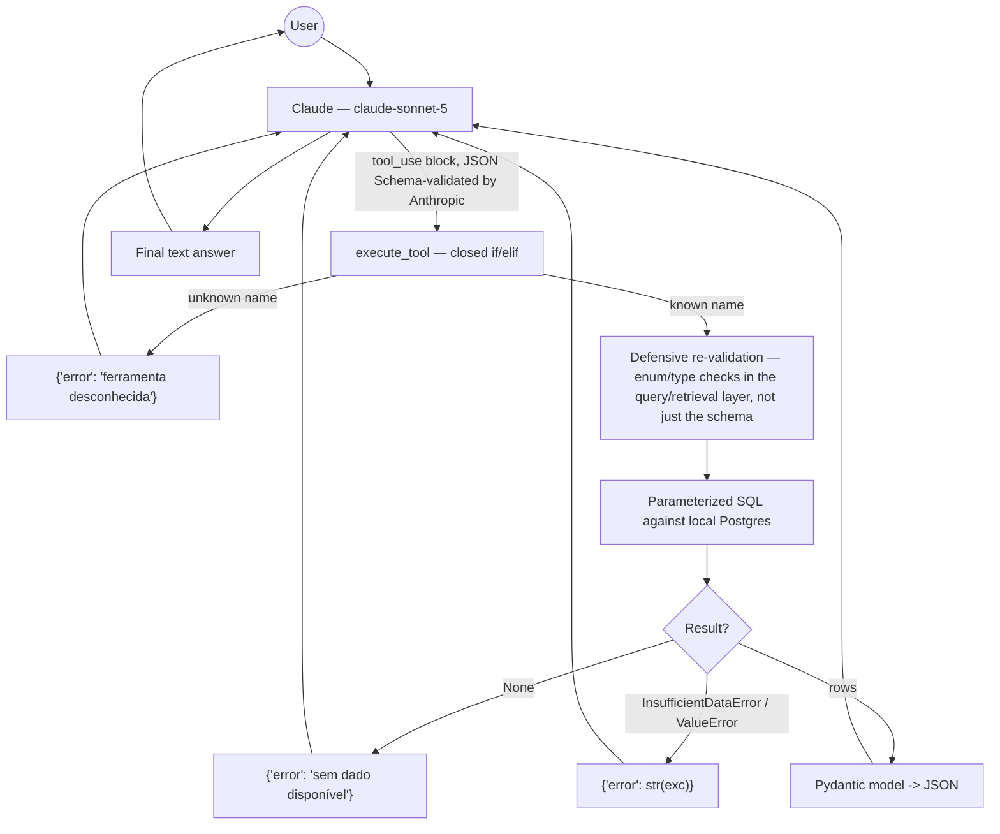

# Tool Calling

## Flow

There is no separate "authorization" step in this flow because there is
nothing to authorize against — every tool is a read-only query against a
single local database with no per-user/per-role distinction (single-user,
personal-use system, see `docs/security/AI_SECURITY.md` for why this is an
explicit, documented scope decision rather than a gap). The "Dispatch" step
functions as the allowlist: `execute_tool`'s `if/elif` chain is a closed set
of exactly 9 names — there is no dynamic tool lookup, no `eval`/`getattr`
on the tool name, and no code path that executes a tool the chain doesn't
explicitly name.

## Tool inventory

All 9 tools are defined in `src/rag_b3/generation/tools.py` (`TOOL_SPECS`)
and dispatched in the same file (`execute_tool`).

| Tool | Purpose | Required input | Executes | Write access? |
|---|---|---|---|---|
| `ibov_latest_bar` | Most recent trading day | none | `query.ibov_numeric.get_latest_bar` | No |
| `ibov_variation_between` | Index variation between two dates | `start_date`, `end_date` | `variation_between` | No |
| `ibov_variation_last_n_trading_days` | Variation over last N trading days | `n` | `variation_last_n_trading_days` | No |
| `ibov_extreme_between` | Max/min close in a range | `start_date`, `end_date`, `kind` (enum: max/min) | `extreme_between` | No |
| `ibov_all_time_high` | All-time max close | none | `all_time_high` | No |
| `ibov_period_summary` | Aggregate period summary | `start_date`, `end_date` | `period_summary` | No |
| `ibov_compare_periods` | Compare two periods | 4 date fields | `compare_period_summaries` | No |
| `cvm_latest_by_feed` | Latest N items in a CVM feed | `feed_key` (enum, 6 values) | `retrieval.cvm_textual.latest_by_feed` | No |
| `cvm_search` | Keyword search over CVM items | `query_text` | `retrieval.cvm_textual.search_cvm_items` | No |

**All 9 are read-only.** There is no tool that writes to the database,
executes shell commands, makes outbound HTTP requests, or reads/writes the
filesystem. This was verified by reading every branch of `execute_tool` and
every function it calls — none contains an `INSERT`/`UPDATE`/`DELETE`,
`subprocess`, `requests`/`httpx` call, or file I/O.

## Per-tool detail

### Input validation — two layers, not one

1. **Schema layer** (Anthropic-enforced): JSON Schema `input_schema` per
   tool — types, required fields, `enum` constraints for `kind` and
   `feed_key`. This is enforced by the Anthropic API before the model's
   tool call is even considered valid, but it is not something this
   codebase can fully trust (a schema only constrains what a
   well-behaved model sends; nothing stops a future prompt-injection
   payload from trying to coax the model into an out-of-schema call, even
   if the API would reject it).
2. **Application layer** (this codebase, defense-in-depth): every enum-typed
   field is re-checked in the query/retrieval function itself, independent
   of the schema — e.g. `cvm_textual.latest_by_feed` raises `ValueError` for
   an invalid `feed_key` even though the schema already constrains it
   (`retrieval/cvm_textual.py`), and `ibov_numeric.extreme_between` checks
   `kind in ("max", "min")` before using it to build a SQL `ORDER BY`
   direction. **Finding fixed this session:** `limit` on `cvm_latest_by_feed`
   /`cvm_search` had *no* upper bound anywhere — the schema declares it as
   `"type": "integer"` with no `maximum`, and neither `latest_by_feed` nor
   `search_cvm_items` clamped it before using it in `LIMIT %s`. A
   large/negative value from a manipulated or malfunctioning model call
   would have gone straight to Postgres unclamped. Fixed by adding
   `_clamp_limit()` in `src/rag_b3/retrieval/cvm_textual.py` (clamps to
   `[1, 50]`), covered by new tests
   (`tests/integration/test_cvm_textual.py::test_latest_by_feed_clamps_excessive_limit_instead_of_trusting_the_caller`
   and the `search_cvm_items` equivalent).

### Authorization

None, by design — see `docs/security/AI_SECURITY.md` §"Excessive Agency"
for the full analysis of why a single-user, read-only, localhost-bound tool
surface doesn't need per-call authorization today, and what would need to
change if that scope assumption ever changes (e.g., multi-user deployment).

### Timeout / retry

No per-tool-call timeout or retry exists in the tool-execution path itself
— each tool call is a single synchronous Postgres query, and the whole
`answer_question` loop is bounded by `MAX_TOOL_ITERATIONS = 5` (worst-case
5 tool calls per request) rather than a per-call timeout. This is a
reasonable choice given queries here are simple, indexed, single-table
lookups against a small table (2,644 rows for the numeric table, 60 for
CVM) — not the kind of query where an unbounded runaway is a realistic
risk today. This would need revisiting if the schema/data volume grows
significantly.

### Error handling

`execute_tool` catches exactly `(InsufficientDataError, ValueError)` and
converts both to `{"error": str(exc)}` — deliberately returned to the model
as a tool result rather than raised, so the model can see the error and
respond "informação insuficiente" instead of the request failing outright.
Any other exception type (e.g. a real DB connectivity failure) is **not**
caught here and propagates up through `answer_question` to the web layer's
global exception handler (added Session 2, `web/app.py`), which returns a
generic 500 — an important distinction: expected domain errors are handled
gracefully at the tool layer, unexpected infrastructure errors fail loudly
rather than being silently swallowed as if they were "insufficient data."

### Cost

Each tool call is one Postgres round-trip against small, indexed tables —
negligible compute cost. The cost that matters for this system is the LLM
token cost of the surrounding tool-use loop (captured as of Session 2, see
`docs/evaluation/methodology.md`), not the tool execution itself.

### Security risk summary (see `docs/security/AI_SECURITY.md` for the full threat model)

| Risk | Applies here? | Why |
|---|---|---|
| Arbitrary code execution via tool | No | No tool accepts/executes code, shell commands, or file paths |
| SQL injection via tool input | No | Every query is parameterized; enum fields are allowlist-checked before use in SQL keyword position (e.g. `ORDER BY {order}`) |
| Unbounded resource consumption via tool input | **Was possible** (unclamped `limit`) — **fixed this session** | See "Input validation" above |
| Data exfiltration beyond intended scope | Low | Every tool queries exactly one of two tables, both containing only public market-index/regulatory data — there is no tool that can reach `ingestion_audit_log`, quota tables, or any other schema object |
| Tool result used to smuggle a prompt-injection payload back into the model | Possible in principle (`cvm_search` returns feed titles/summaries sourced from an external RSS feed) | See `docs/security/AI_SECURITY.md` §"Indirect Prompt Injection" |
