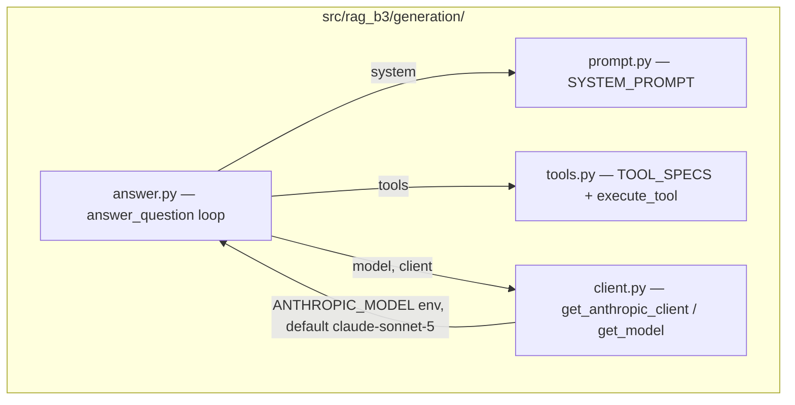

# AI Architecture

## Why SQL + full-text search instead of vector RAG

This is the single most interview-relevant architectural decision in the
project, and it's worth stating precisely because "we didn't build a vector
RAG" sounds like a gap until the reasoning is laid out:

1. **The corpus doesn't need approximate retrieval.** One numeric time
   series (Ibovespa daily bars) and ~60 short regulatory RSS items is small
   enough, and the queries against it precise enough ("variation between
   two exact dates", "all-time high"), that exact SQL is both faster to
   build and strictly more correct than embedding similarity search. A
   vector search over "what was the Ibovespa close on 2024-08-28" would
   return an approximate nearest-neighbor match; the SQL version returns
   the exact row.
2. **Numeric correctness matters more than semantic fuzziness here.** A
   financial index chatbot giving an approximately-right number is a worse
   failure mode than one that says "insufficient data." Vector RAG's
   strength — handling paraphrase and semantic similarity over large,
   heterogeneous free text — is not the failure mode this system needs to
   guard against; grounding and citation fidelity are.
3. **This was a real evaluated decision, not a shortcut.** `docs/PRD.md`
   documents it as a deliberate architectural call, and this session's
   pipeline review (`rag-pipeline.md`) re-confirmed no change is warranted
   given the measured evaluation results (faithfulness 0.909, both
   retrieval-dependent golden cases scoring 1.00 — see
   `docs/evaluation/baseline.md`).

The honest trade-off: this design does not generalize to a larger,
messier corpus. If CVM's RSS feeds were replaced with e.g. full PDF filings
running to hundreds of pages, `tsvector` full-text search would degrade and
chunking + embeddings would likely become the right call. That trade-off
line is exactly what should be probed in an interview, and the answer is
"we picked the retrieval mechanism that matches this corpus's actual shape,
not the trendiest one" — see the forthcoming `docs/adr/ADR-002-rag-architecture.md`.

## LLM integration

- **Generator model:** `claude-sonnet-5`, configurable via `ANTHROPIC_MODEL`
  (`src/rag_b3/config/settings.py:11`). Live-verified against the real API
  this session.
- **Judge model:** `claude-opus-4-8`, hardcoded in `src/rag_b3/eval/judge.py`
  — deliberately different from the generator to avoid identity bias.
  Live-verified this session (previously unverified — see
  `docs/audit/TECHNICAL_AUDIT.md` §6.9).
- **No structured-output schema on the final chat answer** — the response
  is free text, meant to read naturally. Structured output *is* enforced
  on: (a) every tool call, via JSON Schema `input_schema`; (b) every eval
  judge call, via forced `tool_choice` + Pydantic validation
  (`ClaimJudgement`, `FaithfulnessResult`, `RelevancyResult`).

## Tool calling — see `docs/ai/tool-calling.md`

A dedicated document is planned for Session 4 (Tool Calling + AI Security),
covering all 9 tools individually (schema, validation, error handling,
security posture). Session 2's contribution here: confirmed no tool grants
write/mutation/shell/network access — all 9 are read-only SQL wrappers, and
this was independently re-verified against `src/rag_b3/generation/tools.py`
this session (no change made).

## Grounding mechanisms (why hallucination is structurally constrained, not just prompted away)

1. All arithmetic happens in SQL — there is no code path for the model to
   compute a number itself.
2. `InsufficientDataError` carries real series bounds, steering the model
   toward an honest "insufficient data" answer instead of a guess anchored
   on training-data recall.
3. Mandatory citation fields (`trade_date`+`source` / title+date+link) are
   enforced by prompt instruction, not by a programmatic citation-check —
   this is the one place where enforcement is "soft" (prompt-only). The
   golden dataset's adversarial cases and this session's real eval run are
   the closest thing to a regression check on this behavior today.
4. Fail-closed loop: `MAX_TOOL_ITERATIONS = 5` — exceeding it raises rather
   than returning a speculative partial answer.

This session's real evaluation run (`docs/evaluation/baseline.md`) is the
first artifact-backed confirmation that these mechanisms hold in practice,
not just in the prompt's stated intent: 4/4 adversarial cases scored
faithfulness 1.00 with clean refusals, and the two data-boundary cases
(1990 query; 2014 CVM sanction predating the 2016 series start) both
correctly reported insufficient data instead of guessing.
