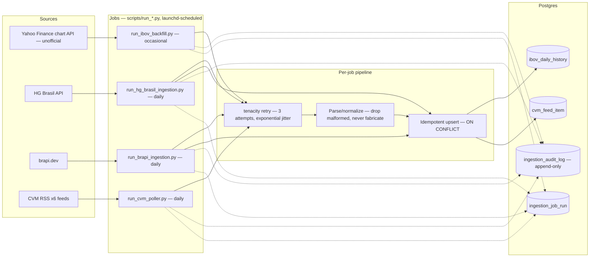
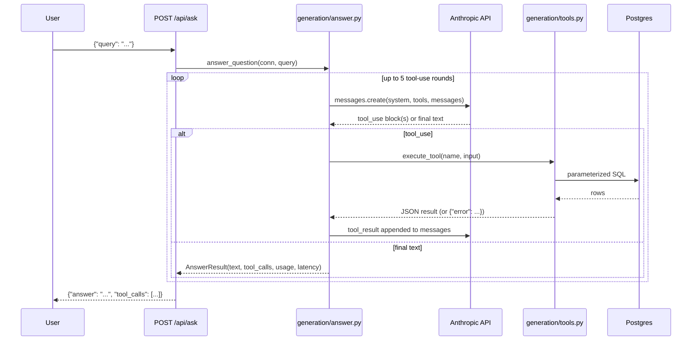

# Data Flow

Two independent flows share the same Postgres database: the **ingestion
flow** (asynchronous, scheduled) and the **query flow** (synchronous, one
request at a time). Neither blocks the other.

## Ingestion flow (asynchronous)

**Idempotency detail that matters:** backfill (`J1`) uses `ON CONFLICT DO
NOTHING` — it never overwrites a day already ingested by the daily job,
because the daily source is treated as more authoritative for the current
day. The daily jobs (`J2`) use `ON CONFLICT DO UPDATE` for the same reason
in reverse. This asymmetry is deliberate, not an oversight — see
`src/rag_b3/ingestion/yahoo_finance/repository.py:9-72`.

**Quota control:** `J2` (HG Brasil) reserves a request slot from a
Postgres-backed quota counter (`hg_brasil_quota_control`,
`reserve_hg_brasil_quota()`) *before* making the HTTP call — a pessimistic
reservation, since HG Brasil doesn't document quota-exceeded behavior in
advance.

## Query flow (synchronous, per-request)

If 5 rounds pass without a final text answer, `GenerationLoopExceededError`
is raised and surfaced as HTTP 502 — a deliberate fail-closed choice over
returning a partial/speculative answer.

## What's captured at each stage (as of this session)

| Stage | Captured | Not captured |
|---|---|---|
| Ingestion | Per-call audit log (source, action, status, http_status, error_code, raw_response), job-run summary | — |
| Query — generation | `input_tokens`, `output_tokens`, `api_calls`, `latency_seconds`, `model_id` on every `AnswerResult` (added this session, see `docs/evaluation/methodology.md`) | Per-request structured logs existed nowhere before this session; `POST /api/ask` now logs a summary line (query length, tool-call count, tokens, latency, model) without logging query/answer content |
| Query — retrieval | Nothing dedicated; folded into the tool_call log | Retrieval-specific latency (SQL execution time) is not separately timed from the overall generation latency |
