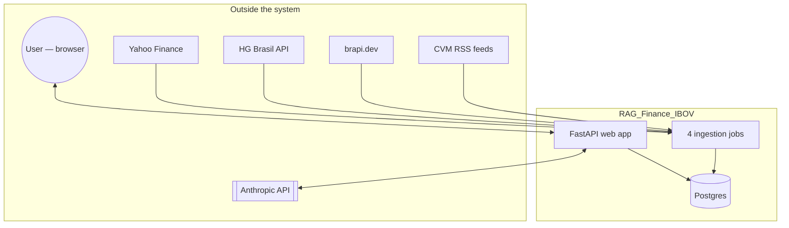

# Architecture Overview

## What this system is

A Portuguese-language chat application answering questions about the
Ibovespa index (B3's benchmark stock index) and Brazilian CVM regulatory
announcements. The user asks a question in natural language; Claude decides
which of 9 read-only tools to call against a local Postgres database, and
answers grounded strictly in what those tools return.

**Framing correction (see `docs/audit/TECHNICAL_AUDIT.md` §1 for full
detail):** despite the "RAG" name, this is not a vector-embedding retrieval
system. There is no chunking, no embedding model, no vector store. Retrieval
is two deterministic mechanisms:

1. Parameterized SQL queries against a table of daily OHLC bars
   (`src/rag_b3/query/ibov_numeric.py`).
2. PostgreSQL native full-text search (`tsvector`) over CVM RSS feed items
   (`src/rag_b3/retrieval/cvm_textual.py`).

This was a deliberate decision (`docs/PRD.md`, `.specify/memory/constitution.md`):
the corpus is small (~60 regulatory items, one numeric time series) and
correctness-critical (a wrong index value is worse than a slightly
imprecise document match), so exact SQL and lexical search outperform
approximate vector similarity for this specific domain. See `ADR-002` (to be
written in a later session) for the full trade-off analysis.

## System boundary

## Component inventory

| Layer | Path | What it owns |
|---|---|---|
| Web | `src/rag_b3/web/` | HTTP surface: `GET /`, `POST /api/ask` |
| Generation | `src/rag_b3/generation/` | System prompt, tool specs/dispatch, Anthropic client, tool-use loop, engineering-metrics capture |
| Numeric query | `src/rag_b3/query/` | Deterministic SQL over `ibov_daily_history` |
| Textual retrieval | `src/rag_b3/retrieval/` | Full-text search over `cvm_feed_item` |
| Ingestion (x4) | `src/rag_b3/ingestion/` | Yahoo Finance, HG Brasil, brapi.dev, CVM RSS — independent jobs |
| Evaluation | `src/rag_b3/eval/` | Custom LLM-as-judge (faithfulness, relevancy) |
| Common | `src/rag_b3/common/` | DB connection, audit logging, job-run tracking, logging config, pricing table |
| Dashboard | `src/rag_b3/dashboard/` | Static HTML report generator (ingestion health only) |

## Runtime topology today

- **One Postgres container** (Docker, `docker-compose.yml`) — the only
  containerized piece.
- **The FastAPI app runs as a bare host process** (`uv run
  scripts/run_chat_web.py`), bound to `127.0.0.1` by default — no
  authentication, single-user, personal-use tool by explicit design.
- **Ingestion jobs run as scheduled host processes** via macOS `launchd`
  (`ops/launchd/`), decoupled from the web app's lifecycle.

See `data-flow.md` for the request/ingestion flows in detail,
`rag-pipeline.md` for the retrieval/generation internals, `ai-architecture.md`
for the LLM/tool-calling design, and `deployment.md` for the current (mostly
absent) deployment posture.
