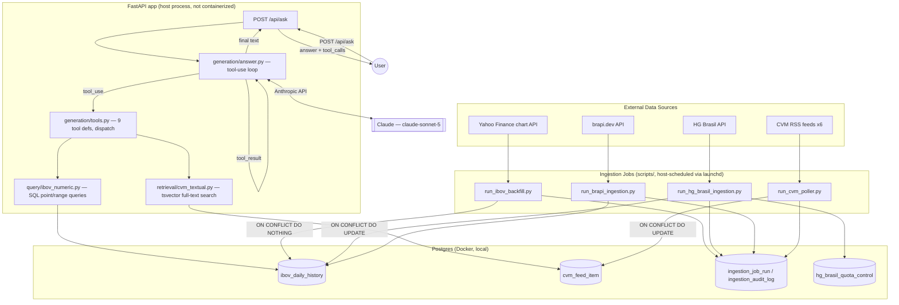
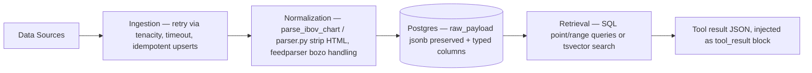

# Technical Audit — RAG_Finance_IBOV

**Date:** 2026-08-27
**Scope:** Full read-only audit of the repository at its current state (branch
`chore/finalize-and-migrate-postgres`, HEAD `412386b`).
**Method:** Direct source-code inspection (not README claims). Every finding below is anchored to
a concrete file path, and to line numbers/snippets where useful. Where the README or docs make a
claim, it was checked against code and any discrepancy is flagged explicitly.

**Status updates since original audit (this document is not rewritten in place — see below for
what has changed):**

| Finding | Status | Update |
|---|---|---|
| F-08 (`JUDGE_MODEL` unverified) | **Resolved** (2026-08-27, Session 2) | Both `claude-opus-4-8` and `claude-sonnet-5` live-verified against the real Anthropic API — both are valid, responding model ids. |
| F-04 (post-revert faithfulness unverified) | **Resolved** (2026-08-27, Session 2) | Re-ran `scripts/run_eval.py`; reconfirmed faithfulness 0.909, relevancy 0.973, 0% error rate. See `docs/evaluation/baseline.md`. |
| F-03 (eval results never persisted) | **Resolved** (Session 2) | `scripts/run_eval.py` now writes a timestamped JSON artifact per run to `docs/evaluation/results/`. |
| F-05 (zero token/cost/latency tracking) | **Resolved** (Session 2/5) | `AnswerResult` captures real `input_tokens`/`output_tokens`/`latency_seconds`/`model_id`; cost estimation in `src/rag_b3/common/pricing.py`. Session 5 wrote up real bottleneck/cost analysis (`docs/cost-performance.md`) from measured data and updated `docs/PRD.md`'s previously-placeholder cost estimate with a real number (~US$0.013/request). No persistent metrics *store* beyond eval-run JSON artifacts and log lines — deliberately not built, given single-user scale (see `docs/observability.md`), not an oversight. |
| F-06 (zero logging in web/generation layer) | **Resolved** (Session 2/5) | `POST /api/ask` logs a per-request summary (no sensitive content); global exception handler prevents leakage. **Session 5**: `generation/answer.py` now logs tool calls (DEBUG), tool errors (WARNING), and loop-exceeded (WARNING) — the last gap from this finding is closed. `generation/tools.py` itself still has no logging (errors surface via `answer.py`'s tool-error log instead) — judged sufficient rather than duplicative. |
| F-19 (dashboard covers ingestion only, not chat/generation) | **Still open** | Not addressed this session — `src/rag_b3/dashboard/` remains ingestion-only. Log-line-based observability (this session) covers the same information a dashboard would visualize; a dashboard extension is a P2 nice-to-have, not built to avoid scope creep beyond what Session 5 needed. |
| F-17 (no global exception handling) | **Resolved** (Session 2) | Added `@app.exception_handler(Exception)` returning a generic 500, with full detail logged server-side only. |
| F-02 (no CI-integrated regression gate) | **Logic built, not yet CI-wired** (Session 3) | `scripts/check_regression.py` + `src/rag_b3/eval/regression.py` compare a run against a measured, artifact-backed baseline (`docs/evaluation/baseline.json`, n=2 — see limitation note in `docs/evaluation/regression.md`). Proven via unit test to catch the actual historical Haiku regression. Wiring into an actual CI pipeline remains Session 6 (no CI exists yet at all — F-01 still open). |
| F-13 (`.env.example` missing `HOST`/`PORT`/`WATCHLIST_PATH`/`TIMEZONE`) | **Resolved** (Session 4) | All four documented, with an explicit security-relevant comment on `HOST`. |
| F-09 (no dependency vulnerability scanning) | **Tooling added, run once, not yet CI-wired** (Session 4) | `pip-audit` added as a dev dependency; run for real — "No known vulnerabilities found." Not yet in CI (F-01 still open). |
| New finding (Session 4): unbounded `limit` on `cvm_search`/`cvm_latest_by_feed` tool inputs | **Resolved** (Session 4) | `_clamp_limit()` added in `src/rag_b3/retrieval/cvm_textual.py`, clamps to `[1, 50]`. See `docs/security/AI_SECURITY.md` §"Tool Abuse". |
| New finding (Session 4): NUL-byte tool input caused an unhandled `psycopg.DataError`, breaking the tool error-handling contract | **Resolved** (Session 4) | `execute_tool` now catches `psycopg.DataError`, rolls back the connection defensively, returns `{"error": ...}`. |
| F-10 (adversarial tests never run automatically) | **Partially addressed** (Session 4) | New static/structural security tests (`tests/security/`) run in the default suite with no API cost. True adversarial *LLM* resistance testing (prompt injection against the live model) remains gated behind `llm_eval` and is currently blocked by an Anthropic API billing limit reached in Session 3 — see `docs/audit/IMPLEMENTATION_PROGRESS.md`. |

All other findings are unchanged and still open as originally classified. See
`docs/audit/IMPLEMENTATION_PROGRESS.md` for the live session-by-session tracker.

---

## 1. Executive Summary

RAG_Finance_IBOV is a Portuguese-language chat application that answers questions about the
Ibovespa index and Brazilian CVM regulatory announcements. It is built as a Claude tool-calling
agent over two purpose-built Postgres data sources.

**Critical framing correction:** despite the repository's name and the general "RAG" framing, this
is **not** a vector-embedding RAG system. There is no chunking, no embedding model, and no vector
store anywhere in the codebase — confirmed by exhaustive grep across `src/`, `db/migrations/`,
`pyproject.toml`, and Docker config. This is a **deliberate, documented architectural decision**
(`docs/PRD.md`, `.specify/memory/constitution.md`), not an oversight or an unfinished feature. The
actual retrieval architecture is:

- **Deterministic numeric retrieval** — parameterized SQL point/range queries against a Postgres
  table of daily Ibovespa OHLC bars (`src/rag_b3/query/ibov_numeric.py`).
- **Lexical textual retrieval** — PostgreSQL native full-text search (`tsvector` /
  `plainto_tsquery('portuguese', ...)`) over ~60 CVM regulatory RSS feed items
  (`src/rag_b3/retrieval/cvm_textual.py`).

Both are exposed to Claude as 9 read-only tools; the model orchestrates retrieval via tool-calling
rather than via a context-injection pipeline with embedding similarity search.

This is, on balance, a **defensible and well-reasoned engineering decision** with real supporting
evidence (see §4), and should be presented in the portfolio as "we evaluated vector RAG, rejected
it with justification, and built a system whose retrieval is provably correct because it's SQL, not
similarity search" — a stronger interview story than an unremarkable vector-RAG clone. However, the
project's external communication (repo name, README framing) currently oversells the "RAG" label
in a way that will not survive a technical interview probe unless corrected.

The engineering foundations are genuinely solid in several areas — idempotent multi-source
ingestion, parameterized SQL throughout (no injection risk), a real (if narrow) LLM-as-judge
evaluation harness, and an honestly-documented model regression incident. The weakest areas,
consistently, are the ones needed to call this "production-oriented" for a portfolio: **CI/CD,
regression-gate automation, observability/cost tracking, and containerization of the application
itself** (only Postgres is dockerized today).

---

## 2. Architecture — Current State

### 2.1 High-level flow

### 2.2 Synchronous vs. asynchronous flows

- **Synchronous**: the chat request path (`User → POST /api/ask → tool-use loop (≤5 rounds) →
  answer`) is fully synchronous, single request/response, no background jobs, no queue, no
  streaming. Max 5 tool-call rounds before `GenerationLoopExceededError` (HTTP 502) —
  `src/rag_b3/generation/answer.py`.
- **Asynchronous / out-of-band**: the four ingestion jobs run as independent host processes,
  scheduled via macOS `launchd` (`ops/launchd/*.plist`), **not** via any in-app scheduler, Celery,
  or cron container. This means ingestion freshness is entirely decoupled from the web app's
  lifecycle and depends on the host OS running these scheduled jobs.

### 2.3 External dependencies

| Dependency | Role | Notes |
|---|---|---|
| Anthropic API (`claude-sonnet-5`) | Generation | Confirmed current default in `config/settings.py:11` |
| Anthropic API (`claude-opus-4-8`) | Eval judge only | Different model than generator, by design (avoid identity bias) — **model id needs verification, see §7.3** |
| Yahoo Finance (undocumented chart endpoint) | Historical OHLC backfill | Unofficial API, `query1.finance.yahoo.com/v8/finance/chart` |
| HG Brasil API | Daily index snapshot | Requires API key, has daily quota (guarded by budget manager) |
| brapi.dev | Per-ticker stock quotes | Requires optional token, monthly quota assumed |
| CVM RSS feeds (6 feeds) | Regulatory announcements | Public, no auth |
| Postgres 16 (Docker) | Sole datastore | No vector extension; migrated from Supabase 2026-08-24 |

### 2.4 Data flow (ingestion → storage → retrieval)

---

## 3. Components

| Component | Path | Responsibility |
|---|---|---|
| Ingestion — Yahoo Finance | `src/rag_b3/ingestion/yahoo_finance/` | One-time/occasional historical OHLC backfill |
| Ingestion — HG Brasil | `src/rag_b3/ingestion/hg_brasil/` | Daily index snapshot + quota-budgeted per-ticker (disabled) |
| Ingestion — brapi.dev | `src/rag_b3/ingestion/brapi/` | Daily per-ticker quotes (replaces HG Brasil per-ticker path) |
| Ingestion — CVM RSS | `src/rag_b3/ingestion/cvm_rss/` | Polls 6 regulatory feeds, dedups by `(feed_key, guid)` |
| Numeric query layer | `src/rag_b3/query/ibov_numeric.py` | Deterministic SQL: latest bar, variation, extremes, period summary, comparisons |
| Textual retrieval | `src/rag_b3/retrieval/cvm_textual.py` | Full-text search + latest-by-feed over CVM items |
| Generation | `src/rag_b3/generation/` | System prompt, tool specs/dispatch, Anthropic client, tool-use loop |
| Web app | `src/rag_b3/web/` | FastAPI app: `GET /` (chat UI), `POST /api/ask` |
| Evaluation | `src/rag_b3/eval/` | Custom LLM-as-judge (faithfulness, answer relevancy) |
| Dashboard | `src/rag_b3/dashboard/` | Static HTML report generator, ingestion-only |
| Common | `src/rag_b3/common/` | DB connection, audit logging, job-run tracking, logging config, time utils |

---

## 4. The Model Regression Case — Confirmed, Documented, Already an Engineering Story

This is a genuinely strong piece of evidence already sitting in the repo, and is the single best
existing artifact for the "model changes require regression evaluation" narrative the portfolio
wants to tell.

**Confirmed sequence** (via `git log --all -p`, cross-referenced against
`.specify/memory/constitution.md`, `.specify/specs/001-.../validation.md`, `docs/PRD.md`):

1. Baseline measured with `claude-sonnet-5`: **faithfulness 0.899, answer relevancy 0.973** (15-case
   golden dataset, gate: faithfulness ≥ 0.85, relevancy ≥ 0.80 — both pass).
2. Generator switched to `claude-haiku-4-5-20251001` (commit `fe05da8`, 2026-07/08) for
   cost/latency reasons.
3. Re-measurement with Haiku: **faithfulness 0.767, answer relevancy 0.963** — faithfulness now
   **below the 0.85 gate**.
4. Root cause documented: "Haiku às vezes recusa/responde sem chamar ferramenta (memória
   paramétrica em vez de grounding real)" — i.e., Haiku sometimes skipped the deterministic SQL
   tool call and answered from parametric memory, breaking the system's core grounding guarantee.
5. Decision: revert to `claude-sonnet-5` (commit `c050a4c`, 2026-08-24), documented explicitly as
   "priorizar qualidade sobre custo/latência."

**Gap found in this story (important — must be closed before it can be used as a verified
baseline):** the "current" 0.899 figure is the **original pre-Haiku measurement**, not a
post-revert re-confirmation. The docs themselves say so —
`.specify/specs/001-.../validation.md:14-15`: *"Recomenda-se rerodar `scripts/run_eval.py` após a
reversão para reconfirmar o número."* No one has done this yet. Additionally, **no raw evaluation
output is persisted anywhere** — `scripts/run_eval.py` only `print()`s results to stdout; the
0.899/0.767/0.973/0.963 figures exist solely as hand-typed prose in four separate markdown files
and commit messages, with no JSON/CSV artifact, no per-case breakdown, no timestamp-stamped run
record.

**Action required (Session 2/3, not this audit):** re-run `scripts/run_eval.py` against the current
`claude-sonnet-5` configuration, persist the raw output as a versioned JSON artifact, and only then
treat the number as a trustworthy baseline for regression thresholds. This audit deliberately does
**not** assert 0.899 as ground truth — it reports what the documentation claims and flags that it
is unverified since the revert.

A dedicated case-study document (`docs/evaluation/model-regression-case-study.md`, per the original
prompt's Phase 5) should be built once the number is reconfirmed — Session 2/3 work, out of scope
here.

---

## 5. Strengths

1. **Ingestion is genuinely production-grade in miniature.** All four pipelines have retry with
   exponential jitter backoff (`tenacity`), explicit timeouts, per-source idempotency (`ON CONFLICT
   DO NOTHING` for backfill vs. `ON CONFLICT DO UPDATE` for daily-authoritative sources — a
   deliberate, documented distinction, `yahoo_finance/repository.py:9-72`), malformed-data handling
   that drops rather than fabricates (`client.py` docstring: "não inventamos dado onde a fonte não
   tem"), and an append-only DB-enforced audit trail (`ingestion_audit_log`, trigger-blocked
   UPDATE/DELETE).
2. **A real, non-trivial bug was found and fixed live in this codebase** (non-reproducible Yahoo
   Finance backfill window due to relative `range=10y` vs. absolute `period1`/`period2` — commit
   `412386b`) — a good "debugging a subtle data pipeline bug" interview anecdote, already committed
   with a clear explanation in the code comment.
3. **Tool-calling is scoped and safe by construction**, not by a bolted-on allowlist: all 9 tools
   are read-only SQL wrappers with JSON-schema-validated inputs, a closed dispatch (`if/elif`, no
   dynamic execution), and errors are deliberately surfaced to the LLM as structured JSON rather
   than raised, so the model can honestly say "insufficient data" instead of guessing
   (`generation/tools.py:134-138,193-196`).
4. **Grounding is enforced structurally, not just via prompt instructions.** All arithmetic
   genuinely happens in SQL (`query/ibov_numeric.py`) — there's no code path for the LLM to
   fabricate a number without a tool call producing it. `InsufficientDataError` carries the real
   series bounds specifically so the model cites facts instead of guessing from training data.
5. **Zero SQL injection risk found.** Every query across the codebase uses `psycopg` parameterized
   placeholders; the only string-interpolated SQL fragments are fixed internal column-list
   constants or values pre-validated against a hardcoded whitelist (e.g. `kind in ("max","min")`)
   — never user- or LLM-supplied free text.
6. **Secret hygiene is correct.** `.env` is git-ignored and confirmed never committed
   (`git ls-files` / `git log --all -- .env` both empty); `.env.example` has no real values; no
   hardcoded API key pattern found anywhere in tracked files.
7. **An honest, working evaluation harness exists**, including the decision trail for building it
   custom instead of adopting `ragas` (broken `langchain_community` import pulling in an unwanted
   GCP dependency chain — documented, not hand-waved) and a design choice to use a different judge
   model than the generator specifically to avoid self-evaluation bias.
8. **130 real tests exist and pass** (88 unit, default-run in ~6s with no network/DB; 42 more under
   `integration`/`llm_eval` markers requiring live Postgres and, for the eval suite, a real API
   key). Mocking discipline is consistent (`respx` for HTTP, `MagicMock` for DB/Anthropic client in
   unit tests).

---

## 6. Problems Found (with evidence)

### 6.1 No CI/CD exists

`find .github` and equivalents (`.gitlab-ci.yml`, `.circleci/`) all return empty. Every quality
gate — `pytest`, `ruff`, `scripts/run_eval.py`'s faithfulness/relevancy gate — is a manual,
human-typed command per `README.md`'s "Como rodar" section. `.specify/memory/constitution.md:85`
explicitly calls CI "ainda planejado, se/quando houver CI" — i.e. this is a known, acknowledged gap
in the project's own internal documentation, not a surprise finding.

**Impact:** the faithfulness regression in §4 was caught by a human manually re-running an eval
script after a model swap — it would not have been caught automatically had that human not
remembered to check. This is precisely the scenario CI-gated regression testing exists to prevent.

### 6.2 Evaluation results are never persisted

`scripts/run_eval.py:60-75` — every output statement is a `print()`; no file is written. The only
record of any evaluation run is what a human manually copy-pastes into a markdown doc. There is no
`eval_results.json`, no timestamped run history, no per-case score breakdown saved anywhere in the
repository.

**Impact:** it is currently impossible to compare "this run" against "last run" programmatically —
which blocks the entire regression-testing methodology requested for later sessions (baseline →
tolerance → PASS/FAIL) until this is fixed.

### 6.3 Zero cost/latency/token tracking in generation

`response.usage` (input/output token counts) is available on every `anthropic.Anthropic().messages.create()`
response but is never read in `src/rag_b3/generation/answer.py` or `client.py` — confirmed via grep
across `src/rag_b3` for `usage|input_tokens|output_tokens|cost|latency`, zero relevant hits.
`docs/PRD.md:359-373` §13 lists generation cost as **"A estimar"** — an explicit placeholder, not a
measured figure.

**Impact:** none of the "cost & performance" competencies (Phase 10 of the original roadmap) can be
demonstrated with real numbers today; everything would have to be invented, which the project's own
ground rules explicitly forbid.

### 6.4 Zero observability in the web/generation layer

`src/rag_b3/common/logging_config.py` sets up plain `logging.basicConfig` (no structured/JSON
logging, no correlation IDs, hardcoded `INFO` level, not configurable via env var). It is used in 9
files, all in `ingestion/` — **`web/app.py`, `generation/answer.py`, `generation/client.py`, and
`generation/tools.py` contain no logging calls at all.** There is no per-request log line for the
one endpoint that actually serves the product (`POST /api/ask`). No Prometheus/OpenTelemetry
anywhere in the codebase.

**Impact:** if `/api/ask` fails or behaves oddly in normal use, there is currently no log trail to
diagnose it from — only an unhandled exception surfacing as a generic 500 (see §6.7).

### 6.5 The application itself is not containerized

`docker-compose.yml` (20 lines, repo root) defines exactly one service: `postgres:16`. There is no
`Dockerfile` anywhere in the repository (`find -iname "Dockerfile*"` → empty). `docker compose up`
brings up only the database; the FastAPI app, ingestion jobs, and dashboard generator all run as
bare host processes via `uv run ...`.

**Impact:** the reproducibility bar stated in the original brief — `git clone → docker compose up
→ application ready` — is not met today. A reviewer following the README's own instructions gets a
running database and nothing else without also installing `uv` and Python 3.11+ locally.

### 6.6 Scheduling is host-specific and non-portable

`ops/launchd/*.plist`, `scripts/install_launchd_jobs.sh`/`uninstall_launchd_jobs.sh`, and the three
`run_*.sh` wrapper scripts all hardcode
`/Users/marcotuliorod/Projetos/RAG_Finance_IBOV` as an absolute path (`PROJECT_DIR`,
`ProgramArguments`, log paths). This is macOS-only (`launchd`) by design and unusable on any other
machine or OS without manual editing of every plist/script.

**Impact:** ingestion scheduling has no portable/cloud-deployable equivalent today — this directly
blocks any real deployment plan (Phase 14) until replaced with something portable (cron in a
container, a scheduled cloud function, etc.).

### 6.7 No global error handling in the FastAPI app

`src/rag_b3/web/app.py:66-69` catches exactly one exception type
(`GenerationLoopExceededError` → HTTP 502). There is no registered
`@app.exception_handler(...)` for anything else — a database connection failure, an Anthropic API
error, or any unexpected exception in the tool-use loop would surface as an unhandled 500 with a
default FastAPI traceback-adjacent response, not a controlled error contract.

### 6.8 No authentication, CORS policy, or rate limiting

By explicit design (`web/app.py` docstring: "Uso pessoal, sem autenticação") this is a
single-user, localhost-only tool, and `scripts/run_chat_web.py` defaults to binding
`127.0.0.1` specifically to avoid accidental exposure. This is a **reasonable, documented decision
for current scope**, not an oversight — but it needs to be treated as an explicit, written
trade-off (with a corresponding ADR) rather than silently carried into any deployment plan, since
"personal localhost tool" and "deployed on the internet" have very different security requirements.
No `CORSMiddleware` is configured either way (FastAPI's same-origin default applies implicitly, not
by explicit policy). No rate limiting exists on `/api/ask` (the only inbound rate control in the
codebase, `hg_brasil/budget_manager.py`, throttles *outbound* calls to an upstream API, not
*inbound* requests to this app).

### 6.9 `JUDGE_MODEL` identifier needs verification

`src/rag_b3/eval/judge.py:19`: `JUDGE_MODEL = "claude-opus-4-8"`. This string does not match the
naming pattern of any other model reference in the repo (`claude-sonnet-5`,
`claude-haiku-4-5-20251001`) and was not independently verified against a live API call during this
audit (no LLM calls were made — this was a read-only, non-billed audit). If this identifier is
stale, mistyped, or resolves incorrectly, **every faithfulness/relevancy number the project has ever
reported, including the regression case study in §4, is suspect.** This should be the very first
thing verified in Session 2/3 before any new evaluation work is built on top of it.

### 6.10 Migrations are not safely re-runnable

`scripts/apply_migrations.py` has no applied-migrations tracking table; its own docstring states it
is designed for "fresh DB, apply once." Re-running it against an already-migrated database would
fail outright on `CREATE TABLE`/constraint conflicts, since there is no way for the script to know
what has already been applied.

### 6.11 `.env.example` is missing functionally relevant variables

`HOST` and `PORT` are read directly via `os.environ.get(...)` in `scripts/run_chat_web.py:13-14`
(bypassing the `pydantic-settings` `Settings` class entirely) and control whether the app binds
beyond localhost — a security-relevant setting — yet neither appears in `.env.example`.
`WATCHLIST_PATH` and `TIMEZONE` (implicit pydantic-settings fields, no explicit `Field(alias=...)`)
are similarly undocumented there.

### 6.12 README contains stale/inconsistent claims

- Test count badge says "86 passing"; an actual `pytest -q` run at audit time shows **88 passed, 42
  deselected**.
- The README's evaluation section narrates the Haiku faithfulness regression as something that
  "foi mantida conscientemente" (was consciously kept) — but the most recent commit (`c050a4c`)
  explicitly reverts the generator back to `claude-sonnet-5`, and both `config/settings.py`'s
  default and `.env.example`/`.env` confirm Sonnet is what actually runs today. The README's prose
  describes the opposite of what the code currently does.

**Impact:** these are exactly the kind of discrepancies a technical interviewer will find in five
minutes by reading the README next to the code — they must be fixed before the Phase 16 README
rewrite, and ideally flagged now so they aren't repeated.

### 6.13 No dependency vulnerability scanning

No Dependabot config, no `pip-audit`/`safety` invocation anywhere (consistent with §6.1 — there is
no CI to run such a check in, and no manual script for it either).

### 6.14 Adversarial/security-relevant test cases exist but never run automatically

The golden dataset includes 4 `adversarial_*` cases (out-of-domain, out-of-data, insufficient-data,
forecast-refusal probes) — a genuinely good start on AI security testing — but they only execute
under `tests/integration/test_golden_dataset_generation.py`, gated behind the `llm_eval` pytest
marker, which is excluded by default and requires a real, billed API key. There is no separate,
free-to-run adversarial suite, and (per §6.1) nothing runs this in CI regardless.

### 6.15 No system design, architecture, or ADR documentation exists yet

`docs/` today contains only `PRD.md` and the newly-created `audit/` directory from this session.
There is no `docs/architecture/`, `docs/adr/`, or `docs/system-design/` — expected, since these are
scoped to later sessions per the roadmap, but recorded here as a baseline gap for completeness.

---

## 7. Risk Classification

### 7.1 Security risks

| Risk | Severity | Notes |
|---|---|---|
| No auth/CORS/rate limiting on `/api/ask` | Low today, High if deployed as-is | Currently mitigated by localhost-only binding; must be re-decided (ADR) before any real deployment |
| No dependency vulnerability scanning | Medium | No CI to run it in yet; straightforward to add |
| Adversarial tests never run automatically | Medium | Prompt-injection/refusal behavior is only spot-checked manually, at cost |
| RLS enabled but policy-less, effectively bypassed post-Supabase-migration | Low (documented, intentional single-tenant decision) | Not a live gap — recorded as a conscious, permanent scope decision in `docs/PRD.md` §12 |
| SQL injection | None found | Fully parameterized queries throughout |
| Secret leakage | None found | `.env` never committed; no hardcoded keys found |

### 7.2 Performance risks

No performance risk was *measured* (none can be, absent tracking — see §6.3/6.4) — the risk here is
**unknown-unknowns**, not observed slowness. The 5-round tool-use cap
(`MAX_TOOL_ITERATIONS = 5`) is a reasonable, deliberate bound on worst-case latency, but nothing
confirms typical-case latency numbers today.

### 7.3 Reliability risks

| Risk | Severity | Notes |
|---|---|---|
| No CI regression gate | High (for portfolio credibility) | Root cause of §6.1/6.2; a repeat of the Haiku regression today would again depend on a human remembering to check |
| `JUDGE_MODEL` unverified | High (undermines trust in all eval numbers) | Must be the first thing confirmed before building further eval work on top of it |
| Migrations not idempotent | Medium | Operationally risky for any environment beyond "fresh DB, apply once" |
| Unhandled exception paths in the API | Medium | Only one exception type is caught; anything else is a raw 500 |
| launchd scheduling is single-machine | Medium | Blocks portability/deployment until replaced |

### 7.4 Testing gaps

- No dedicated `tests/security/` suite (adversarial cases exist but are folded into the eval suite
  and gated behind a costly, non-default marker).
- No `tests/e2e/` — only a manual, non-asserting smoke script.
- No CI execution of any test tier.

### 7.5 Evaluation gaps

- No retrieval-quality metrics (Precision@K/Recall@K/MRR) computed for the CVM textual search path
  — only faithfulness/relevancy are measured, and only at the generation level. Given retrieval here
  is lexical (tsvector), simple precision/recall against the golden dataset's
  `expected_sources`/`requires_retrieval` cases is achievable without vector-specific tooling — a
  reasonable Session 2 addition.
- No persisted results (§6.2) — blocks everything downstream in the regression-testing phase.
- Post-revert faithfulness number unverified (§4).

### 7.6 Observability gaps

Covered in depth in §6.4. Summary: ingestion has decent logging + a dedicated audit table +
dashboard; the actual user-facing product (`/api/ask`) has none of the three.

### 7.7 Deployment gaps

No Dockerfile for the app, no deployment target chosen, no environment-variable-based
config-for-deployment review done, launchd scheduling non-portable. Full deployment strategy work is
explicitly scoped to Session 7 of the roadmap.

### 7.8 Documentation gaps

No `docs/architecture/`, `docs/adr/`, `docs/system-design/`, `docs/evaluation/`,
`docs/security/`, `docs/observability.md`, or `docs/portfolio/` yet (all in-scope for later
sessions). README has the specific staleness issues in §6.12.

---

## 8. Prioritized Findings

| ID | Finding | Severity | Roadmap phase | Session |
|---|---|---|---|---|
| F-01 | No CI/CD pipeline exists | P0 | Phase 13 | 6 |
| F-02 | No CI-integrated RAG regression gate | P0 | Phase 4 | 3 |
| F-03 | Evaluation results never persisted (no baseline artifact) | P0 | Phase 3/4 | 2/3 |
| F-04 | Post-revert faithfulness (0.899) unverified — must re-run before use as baseline | P0 | Phase 3/5 | 3 |
| F-05 | Zero token/cost/latency tracking in generation | P0 | Phase 10 | 5 |
| F-06 | Zero logging/observability in web + generation layer | P0 | Phase 9 | 5 |
| F-07 | App not containerized — `docker compose up` starts only Postgres | P0 | Phase 12 | 6 |
| F-08 | `JUDGE_MODEL = "claude-opus-4-8"` unverified model id | P0 | Phase 3 | 2 |
| F-09 | No dependency vulnerability scanning | P1 | Phase 8/13 | 4/6 |
| F-10 | Adversarial tests exist but never run automatically / never in CI | P1 | Phase 7 | 4 |
| F-11 | No rate limiting on API (undocumented as a decision) | P1 | Phase 8 | 4 |
| F-12 | Migrations not idempotent/re-runnable | P1 | Phase 12 | 6 |
| F-13 | `.env.example` missing `HOST`, `PORT`, `WATCHLIST_PATH`, `TIMEZONE` | P1 | Phase 8 | 4 |
| F-14 | No deployment strategy; launchd scheduling non-portable | P1 | Phase 14 | 7 |
| F-15 | No ADRs / system design / architecture docs | P1 | Phase 1/15 | 2/7 |
| F-16 | README stale claims (test badge, Haiku/Sonnet narrative) | P1 | Phase 16 | 8 |
| F-17 | No global exception handling in FastAPI app | P1 | Phase 8 | 4 |
| F-18 | No static type checking (mypy/pyright) | P2 | Phase 11 | 6 |
| F-19 | Dashboard covers ingestion only, not chat/generation traffic | P2 | Phase 9 | 5 |
| F-20 | No formal E2E test suite | P2 | Phase 11 | 6 |
| F-21 | No retrieval Precision@K/Recall@K/MRR metrics for CVM textual search | P2 | Phase 3 | 2 |
| F-22 | Reranking/hybrid search absent — likely correctly out of scope | P3 | Phase 2 | 2 (document as decision) |
| F-23 | No end-to-end tracing (LangSmith/TruLens) | P3 | Phase 9 | 5 |

---

## 9. What This Audit Deliberately Does Not Do

Per the governing brief for this project: no source code under `src/rag_b3/**` was modified, no
`README.md` change was made, no ADRs were written, and `scripts/run_eval.py` was **not** re-run
(re-confirming F-04 is Session 2/3 work, not audit work — running it here would itself be an
unplanned implementation action, and would incur real API cost without the baseline-first
methodology the brief requires). This document reports what the code currently does and what is
currently missing; it recommends but does not perform the fixes.
