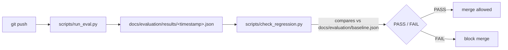

# RAG Regression Testing

## Flow

`scripts/check_regression.py` is not yet wired into CI (there is no CI in
this repository yet — `docs/audit/TECHNICAL_AUDIT.md` F-01, Session 6
scope). It runs standalone today, against whatever the most recent file in
`docs/evaluation/results/` is. The logic itself
(`src/rag_b3/eval/regression.py`) is fully built and unit-tested
(`tests/unit/test_eval_regression.py`) so wiring it into a CI job later is a
matter of adding a workflow step, not writing new logic.

## Why two thresholds, not one

`scripts/run_eval.py`'s own gate (faithfulness ≥ 0.85, relevancy ≥ 0.80) is
an **absolute floor** — it was already documented in
`.specify/memory/constitution.md` before this session and is not something
this session invented. It answers "is quality acceptable in absolute
terms?"

`scripts/check_regression.py` adds a **second, relative check**: is this run
meaningfully worse than the measured baseline, even if it still clears the
absolute floor? A generator that drifts from 0.92 to 0.87 faithfulness would
pass the absolute gate but represents a real, measurable quality
regression — exactly the kind of silent drift a regression suite exists to
catch. `tests/unit/test_eval_regression.py::test_check_metric_fails_when_below_tolerance_even_if_above_hard_floor`
proves this scenario is actually caught, not just described.

## How the baseline and tolerance were established — measured, not invented

Per the project's own ground rules ("não invente thresholds arbitrários...
primeiro execute o dataset atual, registre baseline, depois estabeleça
limites razoáveis"), the process this session actually followed was:

1. Ran `scripts/run_eval.py` for real against the current `claude-sonnet-5`
   configuration: **faithfulness 0.909, relevancy 0.973** (first run,
   2026-08-27T14:43Z).
2. Ran it again to get a second data point: **faithfulness 0.935, relevancy
   0.977** (second run, 2026-08-27T14:53Z).
3. Attempted a third run for a more statistically meaningful sample —
   **blocked**: the Anthropic API returned `400 invalid_request_error:
   Your credit balance is too low`. This is reported here rather than
   hidden; the calibration in `docs/evaluation/baseline.json` is explicitly
   marked `"n": 2` with a note recommending recalibration once more runs
   are affordable.
4. From the 2 runs: mean faithfulness 0.922 (stdev 0.018), mean relevancy
   0.975 (stdev 0.003).
5. Tolerance was set conservatively above roughly 3× the observed stdev
   (faithfulness 0.05, relevancy 0.03) — wide enough to absorb normal
   judge-to-judge noise from a 2-sample estimate, but far tighter than the
   ~0.14–0.17 drop actually observed in the real Haiku regression. This
   means the tolerance would have caught that regression with wide margin
   (verified directly:
   `tests/unit/test_eval_regression.py::test_check_run_against_baseline_catches_the_actual_haiku_regression`
   feeds the real documented Haiku numbers — 0.767 faithfulness, 0.963
   relevancy — through the actual check logic and asserts it fails).

## Known limitation

**n=2 is a thin sample for a stdev-based tolerance.** This is stated
plainly rather than presented as more rigorous than it is. The tolerance
values (0.05 faithfulness, 0.03 relevancy) are a defensible, conservative
starting point — not a final, statistically confident number. Recommended
follow-up once API budget allows: accumulate ≥5 calibration runs and
recompute `docs/evaluation/baseline.json` with a proper stdev estimate
before treating this gate as production-grade.

## What "regression" catches vs. what it can't

Catches: any generator/prompt/model change that measurably moves mean
faithfulness or relevancy below the calibrated band, or that introduces
generation errors (`error_rate` must stay 0%).

Doesn't catch: per-case regressions that don't move the mean enough to
cross the band (e.g., one case getting worse while another improves,
netting out close to baseline) — the current check is aggregate-only. A
per-case regression check (flagging any individual case whose score drops
sharply even if the mean holds) is a reasonable Session-6-or-later
enhancement, not built this session to avoid scope creep beyond what's
needed for a first working regression gate.
