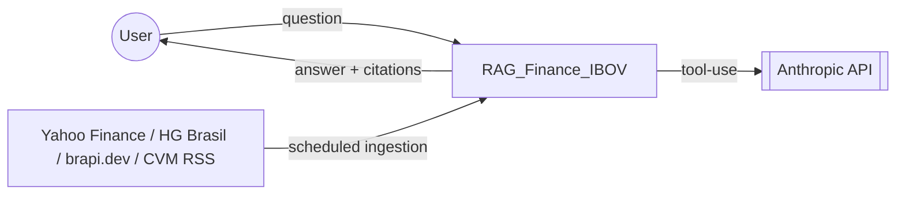

# System Design — Context

## Problem

A user wants quick, trustworthy answers about the Ibovespa index (Brazil's
main stock market benchmark) and related CVM (Brazilian securities
regulator) announcements, without manually checking multiple sources or
risking an LLM hallucinating a plausible-sounding but wrong number.

## Who this is for

One user (the author), asking questions like "how did the Ibovespa perform
in 2023?" or "did the CVM board decide anything recently that might have
moved the market?" — not a multi-tenant product with different users
needing isolated data or permissions.

## What "done" looks like for this system

Not "handles arbitrary financial questions about any market" — specifically:
Ibovespa index history (since 2016-07-11) and CVM regulatory feed content,
answered with grounding good enough that a wrong or fabricated number is
rare and, when data is genuinely unavailable, the system says so instead of
guessing. `docs/evaluation/baseline.md`'s real measured faithfulness
(0.909-0.935) and the 4/4 adversarial cases scoring clean refusals are the
concrete evidence this bar is being met, not just aimed for.

## System boundary

Everything inside the box is this repository. Everything outside is either
a data source this system reads from (never writes to) or the LLM provider.

## Explicitly out of scope

- Individual stock quotes (only the aggregate index).
- Personalized investment recommendations.
- Future price predictions.
- Multi-user support, accounts, or permissions.

Each of these is a system-prompt-enforced refusal domain
(`src/rag_b3/generation/prompt.py`), not an accidental gap — see
`docs/architecture/ai-architecture.md`.

## Related documents

- `docs/architecture/overview.md` — component inventory and runtime topology.
- `docs/architecture/data-flow.md` — the two independent flows (ingestion, query).
- This directory's `architecture.md`, `scalability.md`, `reliability.md`,
  `security.md`, `trade-offs.md` — the deeper system-design analysis this
  context sets up.
